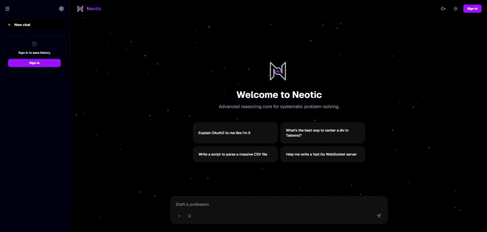

# Neotic: Advanced AI Reasoning & Visualization

[](https://www.gnu.org/licenses/gpl-3.0)
[](https://react.dev/)
[](https://nextjs.org/)
[](https://fastapi.tiangolo.com/)
[](https://www.python.org/)

**Neotic** is an enterprise-grade AI reasoning platform that bridges the gap between complex Chain-of-Thought (CoT) processes and user understanding. By visualizing internal analytical steps as a dynamic Directed Acyclic Graph (DAG), Neotic provides unprecedented transparency into AI decision-making.


*A glimpse into the dynamic, real-time visual reasoning interface of Neotic.*

---

### Hackathon Spotlight

Developed and presented at **HIRE-4-THON**, a National Level Hackathon organized by **K.S. School of Engineering and Management (KSSEM)**.

---

## Key Features

- **Visualized Reasoning Graph:** Real-time rendering of AI's internal reasoning chain using `@xyflow/react` (React Flow) as an interactive DAG.
- **Gemini-Flash Integration:** High-speed reasoning powered by Google's Gemini 2.0 Flash models with dynamic model negotiation.
- **Progressive RAG Engine:** Built-in Retrieval-Augmented Generation (LangChain + ChromaDB) for querying local PDF/TXT knowledge bases.
- **Multi-Tier Auth & Quota:** Secure session management via Firebase with an intelligent guest-quota system.
- **Glassmorphic UI:** High-fidelity interface with dynamic dark/light modes, animated particle backgrounds, and custom Markdown parsing.
- **Enterprise MVC Architecture:** Monolith-free design with clear separation of `services`, `controllers`, and `middlewares`.

---

## Tech Stack

### Frontend

- **Framework:** Next.js 16 (React 19)
- **Styling:** Tailwind CSS 4 + Lucide Icons
- **Visualization:** React Flow (@xyflow/react)
- **Authentication:** Firebase Auth & Firestore

### Backend

- **Core:** Python FastAPI + Uvicorn
- **AI Core:** Google Generative AI (Gemini 2.0 Flash)
- **Data Processing:** LangChain + ChromaDB (for RAG)
- **Real-time:** WebSockets for RAG visualization streaming

---

## System Architecture


The Neotic engine orchestrates a low-latency pipeline between the user and the LLM, streaming thought fragments in real-time to prevent "black box" waiting periods.

---

## Getting Started

### Prerequisites

- **Node.js** v22.x — [nodejs.org](https://nodejs.org)
- **pnpm** v11.x — installed automatically via corepack or `npm i -g pnpm`
- **Python** 3.10 or newer — [python.org](https://www.python.org)
- **Firebase Project** (for Authentication & Session Sync)
- **Google AI Studio API Key** (Gemini 2.0 Flash)

---

### Option 1: Linux / macOS / WSL (Bash)

#### 1. Automated Setup (Recommended)
Run the setup script from the project root to install all dependencies and initialize the Python virtual environment:

```bash
chmod +x setup.sh && ./setup.sh
```

#### 2. Configure Environment
```bash
cp .env.example .env.local
cp .env.example server/.env
```
> Open both `.env.local` and `server/.env` and add your **Google AI Studio Key** and **Firebase Configuration Keys**.

#### 3. Start Development Servers
```bash
# Terminal 1 — Start Frontend:
pnpm dev

# Terminal 2 — Start Backend:
cd server
source .venv/bin/activate
python server.py
```
- Frontend: `http://localhost:3000`
- Backend: `http://localhost:8001`

---

### Option 2: Windows (PowerShell)

#### 1. Install Dependencies & Setup Virtual Environment
Run the following commands in PowerShell from the project root:

```powershell
# Install frontend dependencies
pnpm install

# Setup Python backend virtual environment
cd server
python -m venv .venv
.\.venv\Scripts\activate
pip install -r requirements.txt
cd ..
```

#### 2. Configure Environment
```powershell
Copy-Item .env.example .env.local
Copy-Item .env.example server\.env
```
> Open `.env.local` and `server/.env` and fill in your **Google AI Studio Key** and **Firebase Configuration Keys**.

#### 3. Start Development Servers
```powershell
# Terminal 1 (PowerShell) — Start Frontend:
pnpm dev

# Terminal 2 (PowerShell) — Start Backend:
cd server
.\.venv\Scripts\activate
python server.py
```
- Frontend: `http://localhost:3000`
- Backend: `http://localhost:8001`

---

## Project Structure

```text
Neotic/
├── src/                # Next.js Frontend
│   ├── app/            # App Router (Parallel & Intercepting Routes)
│   ├── components/     # UI/UX & React Flow Visualizers
│   ├── hooks/          # Custom state hooks (useChatState, etc.)
│   └── api/            # Isolated Chat & RAG clients
├── server/             # Python FastAPI Backend
│   ├── src/            # Backend MVC Core
│   │   ├── routes/     # Chat & AI Endpoints
│   │   ├── middlewares/# Auth & CORS handlers
│   │   └── rag/        # Vector DB & WebSocket Logic
│   └── server.py       # Application Entry Point
└── public/             # Static Assets & Architecture Documentation
```

---

## The Development Team

| Name             | Role                            | USN        |
| :--------------- | :------------------------------ | :--------- |
| **Aryan Kumar**  | **Lead Architect / PM**         | 1KG23AD002 |
| **Tanmay Singh** | **UI/UX Engineer / WebSockets** | 1KG23AD056 |
| **Pranav**       | **Backend Engineer / API**      | 1KG23CB038 |
| **G Pavan**      | **AI Specialist / RAG**         | 1KG23CB014 |

---

## License

This repository is licensed under the **GNU General Public License v3.0**. See the [LICENSE](LICENSE) file for more details.

---

_Developed with excellence by the Team Neotic (2026)._
